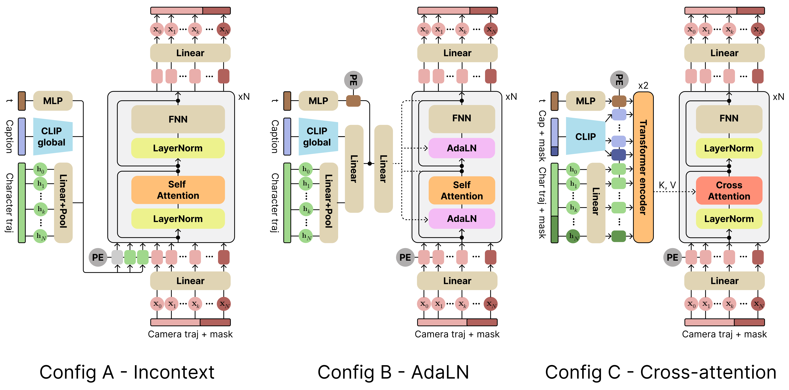
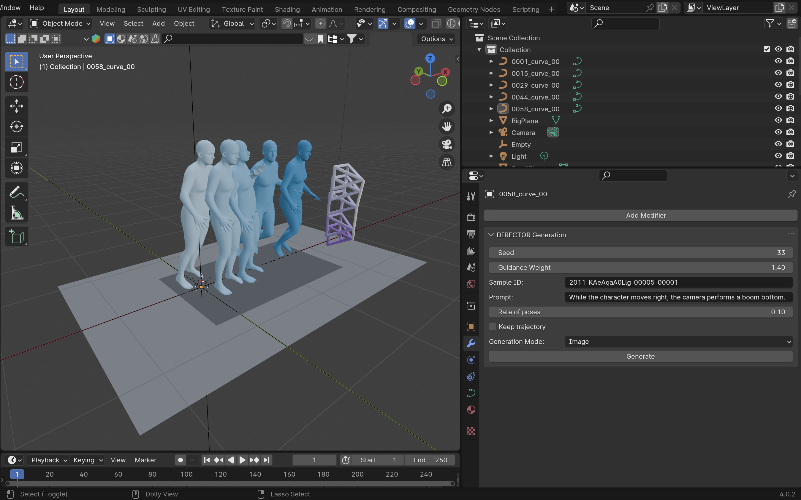
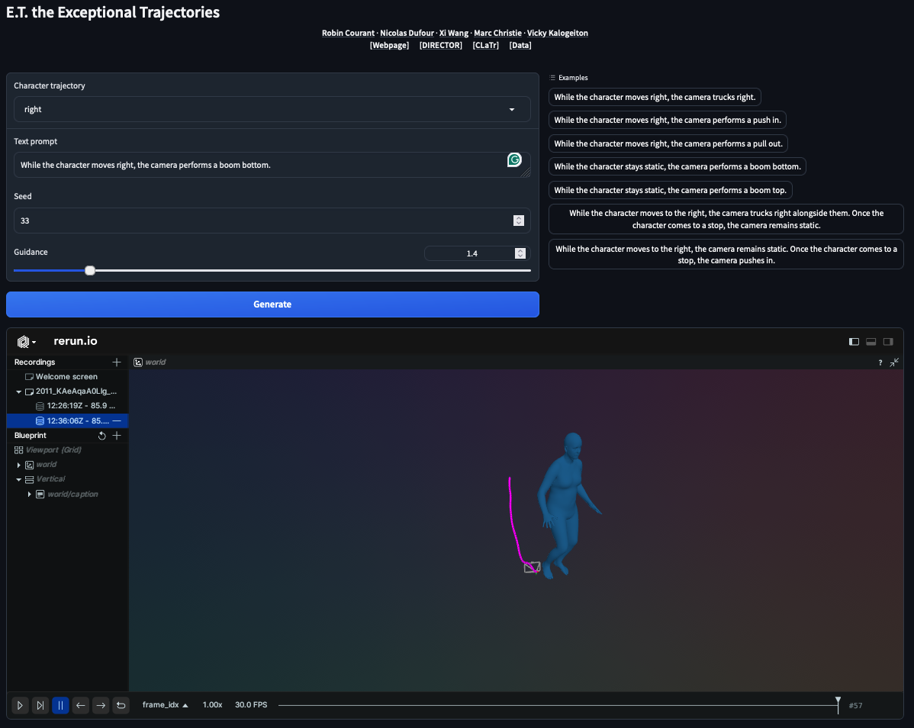

<div align="center">

# E.T. the Exceptional Trajectories
## DIRECTOR

<a href="https://robincourant.github.io/info/"><strong>Robin Courant</strong></a>
·
<a href="https://nicolas-dufour.github.io/"><strong>Nicolas Dufour</strong></a>
·
<a href="https://triocrossing.github.io/"><strong>Xi Wang</strong></a>
·
<a href="http://people.irisa.fr/Marc.Christie/"><strong>Marc Christie</strong></a>
·
<a href="https://vicky.kalogeiton.info/"><strong>Vicky Kalogeiton</strong></a>

[]()

</div>


<div align="center">
    <a href="https://www.lix.polytechnique.fr/vista/projects/2024_et_courant/" class="button"><b>[Webpage]</b></a> &nbsp;&nbsp;&nbsp;&nbsp;
    <a href="https://huggingface.co/spaces/robin-courant/DIRECTOR-demo" class="button"><b>[Demo]</b></a> &nbsp;&nbsp;&nbsp;&nbsp;
    <a href="https://github.com/robincourant/CLaTr" class="button"><b>[CLaTr]</b></a> &nbsp;&nbsp;&nbsp;&nbsp;
    <a href="https://github.com/robincourant/the-exceptional-trajectories" class="button"><b>[Data]</b></a> &nbsp;&nbsp;&nbsp;&nbsp;
</div>

<br/>



---

## News

📢 **25/Oct/24** - Released [SMPL-H files](https://huggingface.co/datasets/robin-courant/et-data/blob/main/smplh.tar.gz) for the mixed dataset.

<br>

## Getting started

<details><summary>Create environment</summary>
&emsp;

Create conda environment:
```
conda create --name director python=3.10 -y
conda activate director
```

Install dependencies:
```
conda install pytorch pytorch-cuda=12.1 -c pytorch -c nvidia
conda install pytorch3d -c pytorch3d
pip install -r requirements.txt
```

Note: `pytorch3d` installation can be tricky. Please follow the [official guidelines](https://github.com/facebookresearch/pytorch3d/blob/main/INSTALL.md) if you encounter any issues.

</details>
<br>

<details><summary>Set up the dataset</summary>
&emsp;

Check the data repository [here](https://huggingface.co/datasets/robin-courant/et-data).

First, install `git lfs` by following the instructions [here](https://docs.github.com/en/repositories/working-with-files/managing-large-files/installing-git-large-file-storage).


To get the data, run:
```
cd /PATH/TO/THE/DATASET
git clone https://huggingface.co/datasets/robin-courant/et-data
```

Prepare the dataset (untar archives):
```
cd et-data
sh untar_and_move.sh
```

Then copy or symlink the `et-data` folder in `./data`:
```
cd /PATH/TO/CLaTr
ln -s /PATH/TO/THE/DATASET/et-data ./data
```
</details>
<br>

<details><summary>Download checkpoints</summary>
&emsp;

Run:
```
sh download_checkpoints.sh
```
</details>
<br>

## Usage

Note: You can specify the:
- **DIRECTOR architecture**, i.e. A: `incontext_director`, B: `adaln_director`, C: `ca_director`.
- **Subset**, `pure` (only simple camera trajectories) or `mixed` (simple and complex camera trajectories).

To launch training, run:
```
HYDRA_FULL_ERROR=1 python src/train.py \
diffuser/network/module=ARCHITECTURE_NAME dataset.trajectory.set_name=SUBSET_NAME
```

To launch evaluation, run:
```
HYDRA_FULL_ERROR=1 python src/evaluate.py
compnode.num_gpus=1 \
diffuser/network/module=ARCHITECTURE_NAME dataset.trajectory.set_name=SUBSET_NAME \
checkpoint_path=CHECKPOINT_PATH diffuser/network/module=rn_mdm diffuser.guidance_weight=GUIDANCE_WEIGHT
```

## Visualization

There are 3 different ways of visualizing results, using [blender](https://www.blender.org/), [rerun](https://rerun.io/) and [gradio](https://www.gradio.app/).

Note: You will need meshes, which are not yet released with the dataset.

<details><summary>Blender visualization</summary>
&emsp;

First, install blender:
1. Follow the [official instructions](https://www.blender.org/download/).
2. Locate the python installation used by **conda** with the following line (`/PATH/TO/CONDA/ENV/`):
   ```
   conda env list | grep '*'
   ```
3. Locate the python installation used by **blender** with the following line (`/PATH/TO/BLENDER/python`):
   ```
   blender --background --python-expr "import sys; import os; print('\nThe path to the installation of python of blender can be:'); print('\n'.join(['- '+x.replace('/lib/python', '/bin/python') for x in sys.path if 'python' in (file:=os.path.split(x)[-1]) and not file.endswith('.zip')]))"
   ```
4. Link conda env to blender python with the following line:
   ```
   ln -s /PATH/TO/CONDA/ENV/ /PATH/TO/BLENDER/python
   ```

To launch Blender through the command line, run:
```
blender PATH/TO/BLENDER_FILENAME
```

Then, in Blender, go to the `Scripting` tab and open `visualization/blender_viz.py`.

Next, go to the `Modifiers` tab (wrench tool icon), enter your desired parameters, and generate your scene.



</details>
<br>

<details><summary>Rerun visualization</summary>
&emsp;

To launch Rerun visualization script, run:
```
python visualization/rerun_viz.py
```


</details>
<br>

<details><summary>Gradio visualization</summary>
&emsp;

To launch Gradio visualization script, run:
```
HYDRA_FULL_ERROR=1 python visualization/gradio_viz.py
```



</details>
<br>

## License

This code is distributed under an [MIT LICENSE](LICENSE).

Note that our code depends on other libraries, including PyTorch, PyTorch3D, Hugging Face, Hydra, and uses datasets which each have their own respective licenses that must also be followed.
